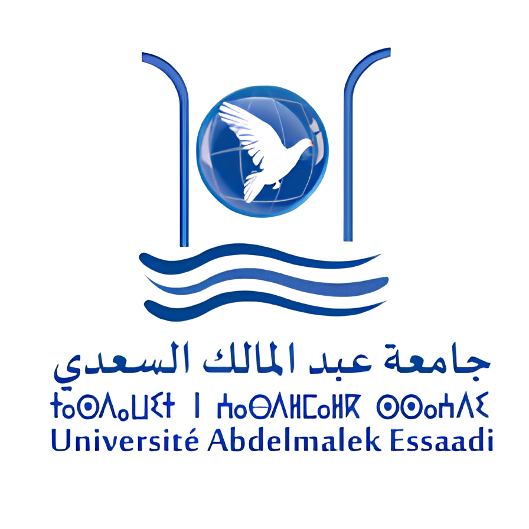

<!-- institutional header -->

  
  

    <b>Abdelmalek Essaâdi University</b> 
    National School of Applied Sciences of Al-Hoceima — ENSAH 
    Data Engineering · Academic year 2025 / 2026
  

  

<!-- title block -->

  

    End-of-studies project defense
  

  <h1 style="font-size: 3.1rem; line-height: 1.12; font-weight: 800;" v-motion :initial="{ opacity: 0, y: 16 }" :enter="{ opacity: 1, y: 0, transition: { delay: 300 } }">
    From RPA robots to autonomous browser agents
  </h1>
  

    brag — a containerised, self-learning browser agent for enterprise
    workflow automation. The App Layer of Orange's RPA migration.
  

<!-- people -->

  

    
Presented by

    
<b>Alaoui Mhamdi Hamza</b>

    
Data Engineering — ENSAH

  

  

    
Supervised by

    
<b>Pr. Achraf Boumhidi</b> — ENSAH

    
<b>Mr. Fayçal Benhayoun</b> — Neo Tech IT

  

  

    
Jury

    
<b>Pr. Achraf Boumhidi</b> · supervisor

    
<b>Pr. Mohamed Cherradi</b> · examiner

    
<b>Pr. Nada Tassi</b> · examiner

  

<!-- bottom strip -->

  Defended on <b>24 June 2026</b>
  Internship · 2 February → 30 July 2026
  Host company
    
    
  

<!--
Good morning. Thank the jury. One sentence: "I'm going to show you how we taught
a piece of software at Orange to stop memorising screens — and start understanding them."
Then move on quickly; the cover should take ~20 seconds.
-->
