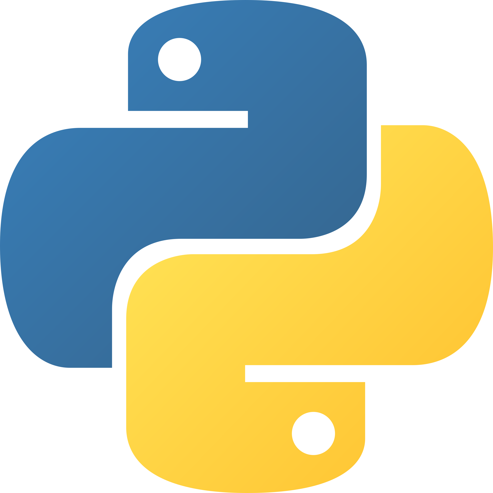
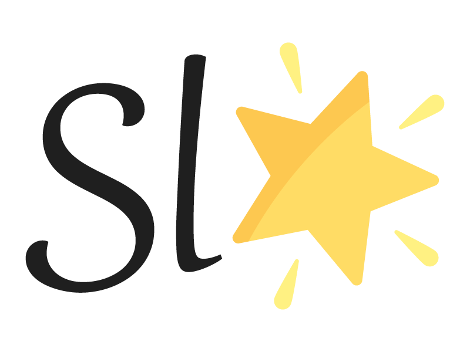
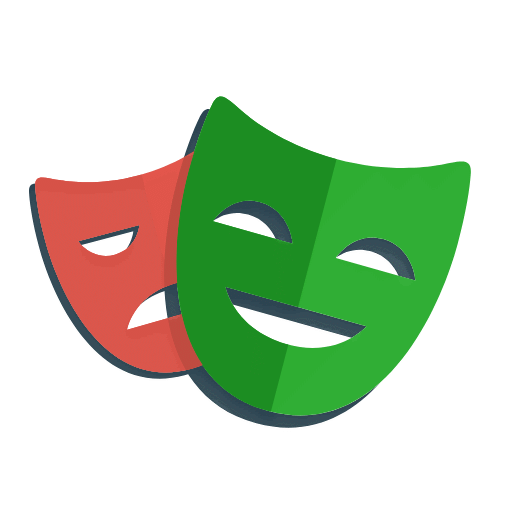
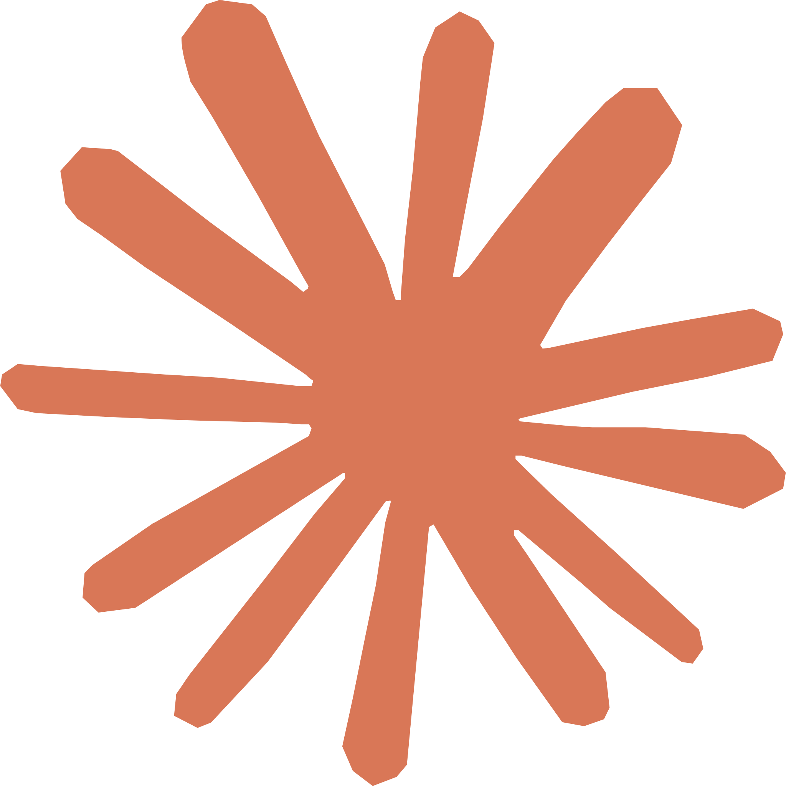
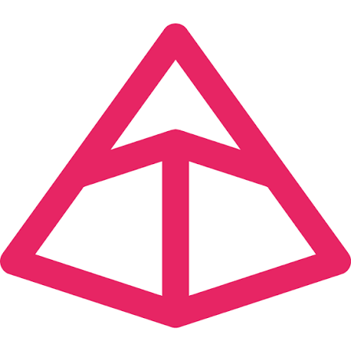
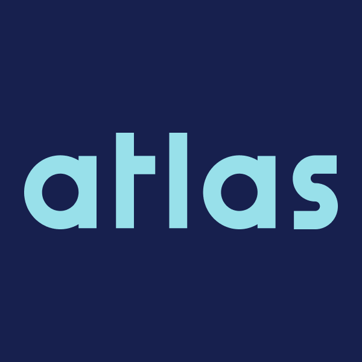
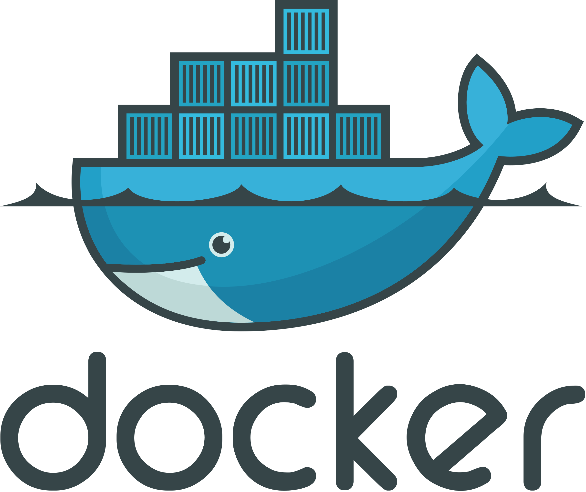
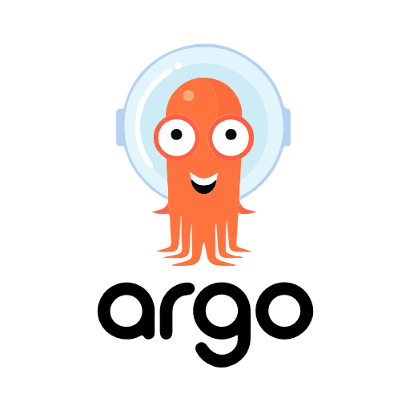
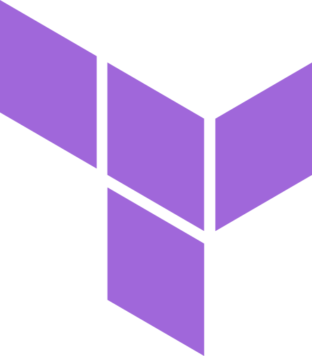

Inside brag · Architecture

## Boring architecture, on purpose

  

    
callers

    
Business-layer agent any A2A client

  

  <carbon:arrow-right class="flow-arrow" />
  

    
brag-api

    
stateless control plane

  

  <carbon:arrow-right class="flow-arrow" />
  

    
NATS JetStream

    
durable work queue + live event bus

  

  <carbon:arrow-right class="flow-arrow" />
  

    
brag-worker × N

    
browser pool both execution paths

  

  

    

PostgreSQL

tasks · traces · skills · pricing

    

brag-ui

operator console

  

  
<b class="text-teal-700 dark:text-teal-300">scale = add replicas.</b> workers hold no task state — capacity is kubectl scale, not a new licensed machine

  
<b class="text-teal-700 dark:text-teal-300">no lost work.</b> atomic claim on every task · a crashed worker's task is simply redelivered

  
<b class="text-teal-700 dark:text-teal-300">an agent among agents.</b> standard A2A (Agent-to-Agent) surface: AgentCard · JSON-RPC lifecycle · live progress stream (SSE)

  
  
  
  
  
  
  
  
  
  
  
  
  
  3 images: api · worker · migrator

<!--
~1 min. Say A2A aloud at first mention: "A2A — Agent-to-Agent, the open protocol for
one agent to call another."
"Boring on purpose": the innovation budget went into the two-path model;
the infrastructure is proven patterns. The control plane runs nothing; workers own the
browsers; they only meet through the queue and the database — that's what makes scaling trivial.
The A2A point matters: brag isn't an app with a private API, it's an agent other agents
call — the Business Layer is just its first customer.
Stack: Python/Starlette/asyncpg · NATS · PostgreSQL+Atlas · Playwright · Anthropic SDK · SvelteKit.
-->
