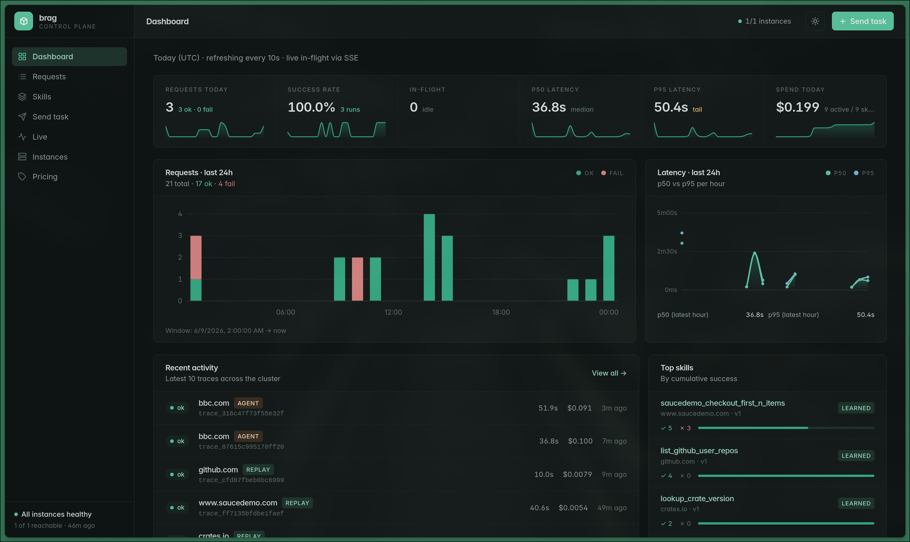

How it works · Observability

## Every run, at a glance

  

  Volume, latency, success rate, and <b>real model spend</b> — plus a <b>live timeline</b> for any running task and the <b>full trace &amp; cost</b> of every past run.

<!--
~0:30. brag-ui, the operator console. "An agent you can't watch is an agent you can't trust in
production." The dashboard is the front door — volume, latency, success rate, real spend across
every worker, no database session.
-->
