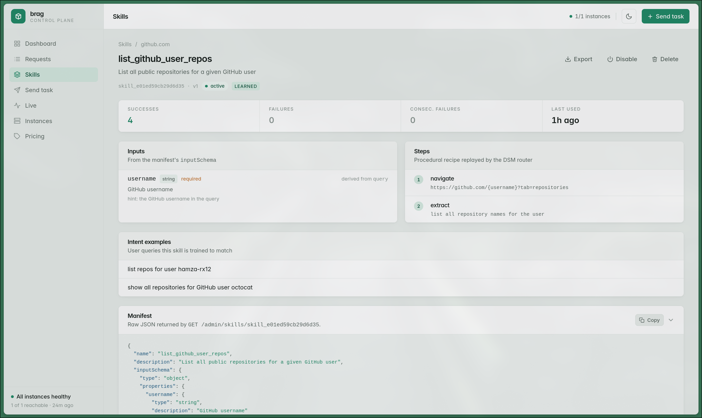

Observability

## Every run, watchable live

  
  

    
    
  

  <carbon:view /> live SSE timeline per task
  <carbon:document /> full trace &amp; cost for any past run
  <carbon:close /> one-click skill disable
  <carbon:meter /> worker fleet via heartbeats

<!--
~0:40. brag-ui, SvelteKit. "An agent you can't watch is an agent you can't trust in production."
Dashboard: volume, success rate, latency, spend. Live timeline: every step as it happens.
Skill catalogue: import/export, one-click disable. The admin token never reaches the
browser — the console's server proxies everything. Keyed to brag's own concepts:
skills, budgets, execution paths — not generic logging.
-->
