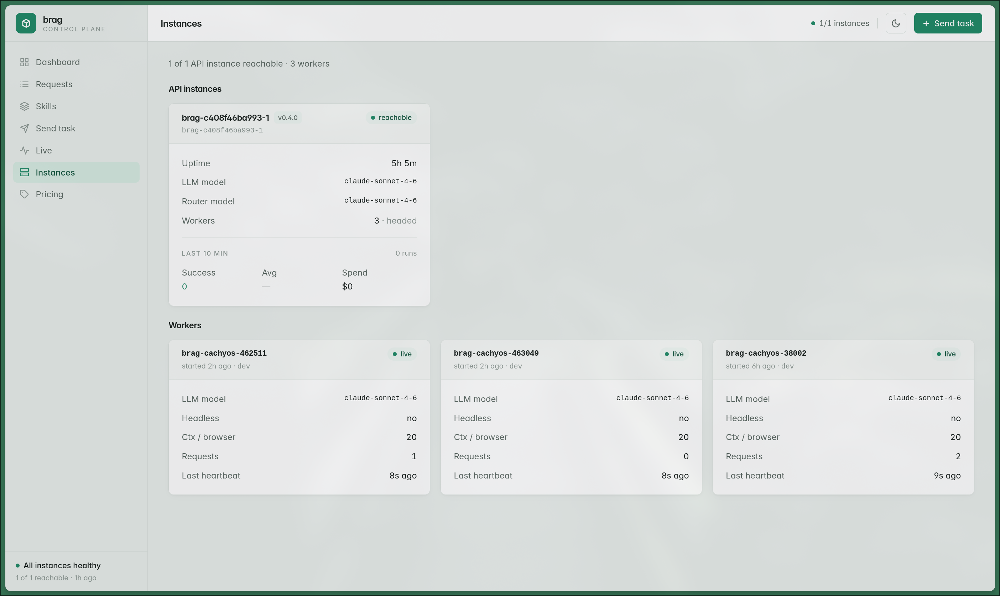

How it works · Observability · 4 / 4

## Every node, accounted for

  

  One control-plane API and its worker fleet — versions, <b>live heartbeats, and health</b> in a single view.

<!--
~0:30. The Instances page is the cluster's vital signs: the control-plane API and every connected
worker, each with its model, version, and a heartbeat — "all instances healthy" at the bottom.
This is what makes the fleet on the dashboard real machines you can point to, not an abstraction.
-->
