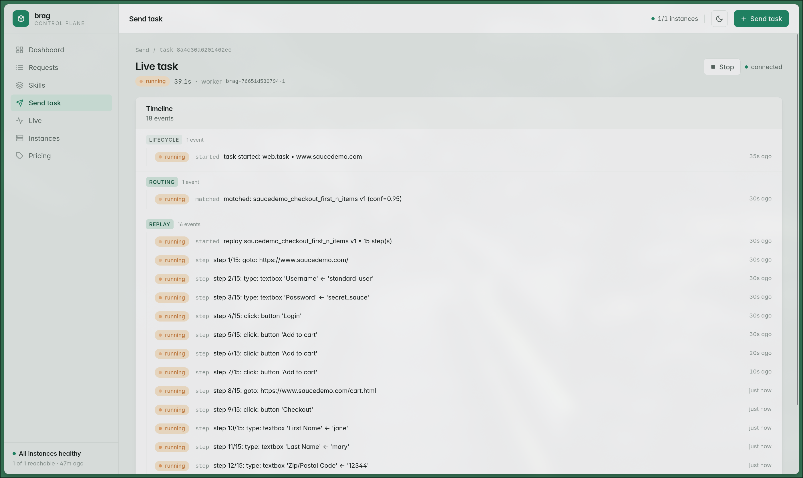

How it works · Observability · 2 / 3

## Watch any task, live

  

  <carbon:view /> live event stream (SSE)
  every step as it happens
  — submit a task and follow it, no log-tailing

<!--
~0:30. Submit a task from the console and the timeline streams every step as it runs — the
path taken, each tool call, the live status — over Server-Sent Events. The same stream a
caller can hold open through the A2A interface.
-->
