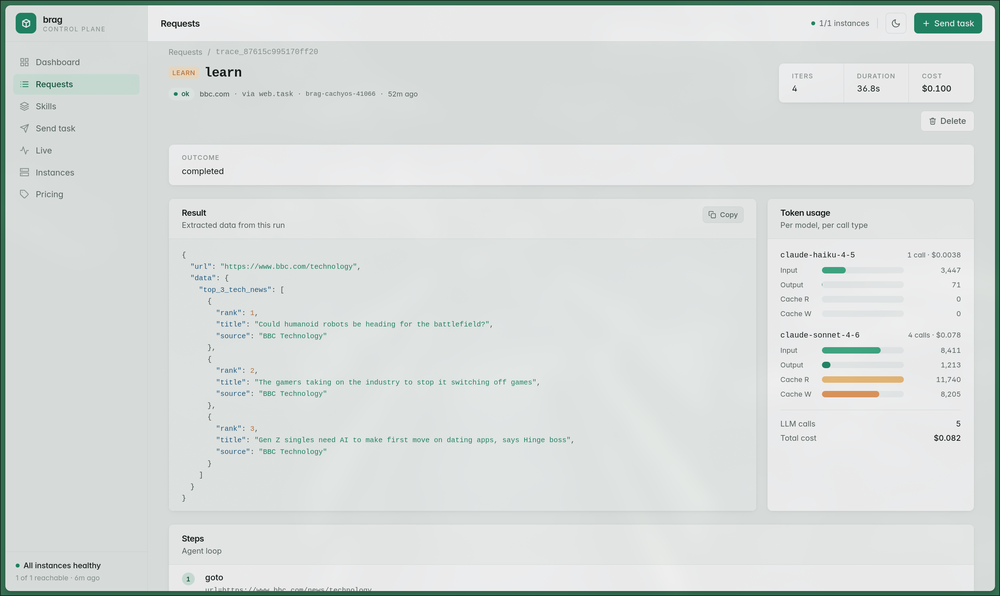

How it works · Observability · 3 / 3

## Every run, fully traced

  

  each tool call &amp; observation
  tokens
  per-run cost
  — open any past request to its complete, saved trace

<!--
~0:30. Every run persists a full trace: the path, each tool call and observation, the
token usage, and a computed monetary cost. Open any past request and read exactly what it
did and what it cost — that is what makes the agent path auditable, the guarantee a raw
chat log can't give.
-->
