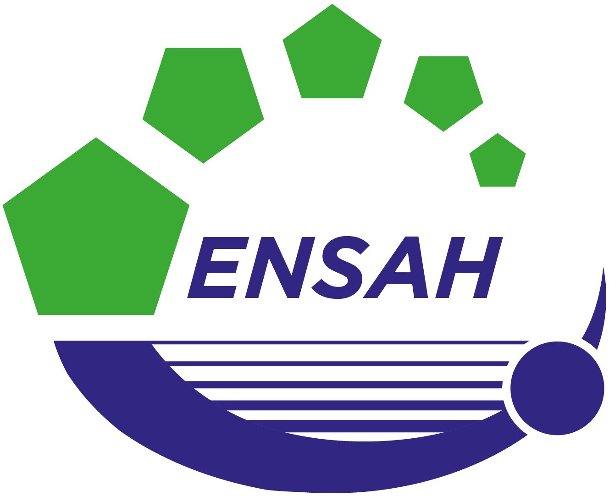
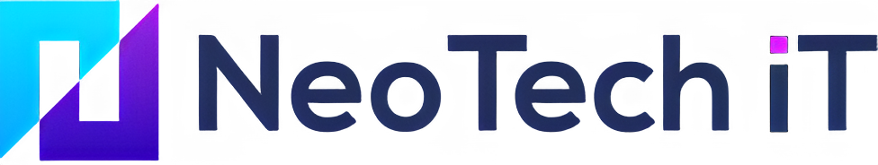

  <h1 class="!text-6xl font-extrabold tracking-tight">Thank you.</h1>
  

  
I'm happy to take your questions.

  

    task
    "answer the jury's questions"
    →
    no saved skill
    →
    agent path
  

  

    
Alaoui Mhamdi Hamza

    
ENSAH · Data Engineering &nbsp;—&nbsp; Neo Tech IT

    

      
      
      
    

  

<!--
Straight close on the slide: "Thank you — I'm happy to take your questions." The router trace is
behind a click — only reveal it if the room is warm. It lands the deck's own mechanic: answering
the jury is a task with no saved skill, so it takes the agent path and reasons it out live.
-->
